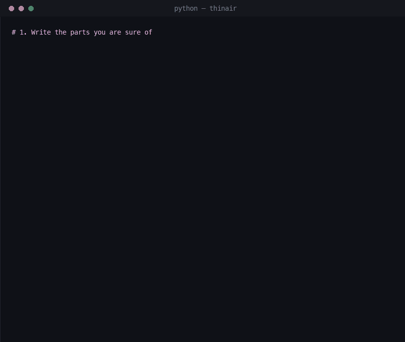

# thinair

Probabilistic Python objects. Invent attributes, methods, anything out of thin air; an LLM of your choice (local or hosted) fills in the blanks, with confidence attached.

<p align="center">
  
</p>

**Code the certain, imagine the rest.**

The entire public surface is one class, and the whole idea fits in one line: a `Thing` is **a value with a probability**.

```python
color = Thing("rusty red", confidence=0.4)   # the value the imagined read
                                             # in the demo handed back
+color      # 'rusty red': the value         (free, no inference)
~color      # 0.4: the probability           (free, no inference)
```

The interface is Python itself. There are no prompt strings, no message arrays, and no output parsing: you write ordinary classes, attributes, and method calls, and the model's capabilities are available wherever you left a blank, always priced with a probability.

Everything you write yourself (code, bare values, your own words) is certain: probability 1.0, and the model can never touch it. Everything the model fills in (a field nobody defined, a method nobody wrote) comes back as a `Thing` that reports how sure it is. The model draws its answers from one axiom: **an object is a story, and every interaction is a continuation of it.** Everything else follows from it; see [SPEC.md](SPEC.md) for the full spec.

Three operators cover the surface, and only `@ <type>` costs an inference call:

| | | |
|---|---|---|
| `+thing` | the value | free |
| `~thing` | the probability | free |
| `thing @ int` | shape it as a type or schema | **one call** |
| `thing @ 0.9` | confidence gate | free |

## Anything can be a Thing

No class is required. Anything lifts into Thing space: a description in words, a bare value with your own doubt attached, or a whole frozen object (`blob @ Car`, below). The simplest is words alone, and your own words count as certain until inference touches them:

```python
from thinair import Thing

spider = Thing("the number of legs on a spider")

+spider                  # "the number of legs on a spider": your own
                         # words back; free, no inference
~spider                  # 1.0: your words are certain

legs = spider @ int      # collapsing happens through typing: one inference
                         # call, and legs is now a Thing carrying 8
+legs                    # 8: the value, a real int
~legs                    # 0.99: the probability, a bare float
```

Requirements chain, and an unmet one drops the value but keeps the probability, so failures explain themselves:

```python
+(spider @ int @ 0.8)          # 8: typed and vouched for at p >= 0.8

car = Thing("a rusty 1990 Toyota Hilux")   # attributes you never defined
guess = car.price_eur @ float @ 0.9        # are imagined on first read,
                                           # so this is a typed, gated guess
+guess                         # None: did not clear the bar
~guess                         # 0.1: the probability survives to say why
if guess: ...                  # failed Things are falsy: gate whole branches
```

The type operand scales from primitives through schemas to real classes:

```python
movie = Thing("the Ridley Scott movie with the xenomorph")

+(movie @ {"title": str, "year": int})   # {'title': 'Alien', 'year': 1979},
                                         # a schema-guaranteed dict

@dataclass
class Record:
    title: str
    year: int

+(movie @ Record)        # Record(title='Alien', year=1979): the model
                         # imagines the kwargs, your constructor builds it
```

You can assert your own doubt, and comparisons happen in Thing space: they are judgments, not byte comparisons:

```python
price = Thing(19_990, confidence=0.4)    # lift a belief into Thing space
+(price @ 0.5)                           # None: you said so yourself

Thing("a car") < Thing("a cat")          # False (p 0.75), an imagined judgment
+car.price < 20_000                      # take the value out first for plain,
                                         # free Python semantics
```

## Deterministic meets probabilistic

Subclass `Thing` and write the parts you are sure of. Written code and bare values are the certain skeleton: they run as ordinary Python, cost nothing, and **the model can never touch them**. Everything else is imagined on demand:

```python
class Car(Thing):
    """A road vehicle."""
    wheels = 4                      # certain by definition

    def horn(self):                 # real code: runs in CPython,
        return "beep"               # inference is never consulted

car = Car("a rusty 1990 Toyota Hilux, engine coughs, "
          "radio stuck on a Finnish schlager station")

car.wheels               # 4: a bare int; no inference ran, nothing billed
car.horn()               # "beep": real code, really executed
+car.color               # "rusty red": imagined where the class was silent
~car.color               # 0.4: honestly unsure about it

car.owner = "Miska"                  # bare assignment: authoritative and
                                     # locked; no plan may overwrite it
car.mood = Thing("unknown so far")   # a slot the model may manage
```

Provenance is permission: bare values belong to the programmer, `Thing` values belong to the imagination.

## Call anything

Any method you never wrote is imagined at call time, and it acts: it reads state, writes state (with confidence, journaled), and calls your real methods, which actually execute. Results are Things, so calls chain:

```python
problems = car.list_your_problems(returns=[str])
+problems                # ['Engine is coughing', 'Radio is stuck on a
                         #  Finnish schlager station', 'High rust level']

car.repair_engine()      # no such method: a plan is imagined and acted
                         # out; the story now contains the repair

car.diagnose().severity_of_worst_issue()   # results are Things: chain
                                           # imagined calls on imagined calls
```

Guard the branches that matter: inside `with Thing.require(0.9):` any resolution below 0.9 raises `Thing.LowConfidence` instead of flowing:

```python
with Thing.require(0.9):
    if car.can_drive():      # p 0.93: clears the bar, the branch is trusted
        plan_road_trip(car)
    car.vin_number           # p 0.02: a guess this wild now raises
                             # Thing.LowConfidence instead of flowing onward
```

## Talk to it

There is no chatbot framework, and `chat` is not a built-in: nobody wrote it, so it is imagined at call time like any other missing method. The object can hold a conversation because a conversation is just more story:

```python
while True:
    print(car.chat(input("> ")))   # chat appears out of thin air too
```
```
> Why did you break down on me this morning?
*cough cough* ... beep. Look, I'm a 1990 Toyota Hilux. I'm rusty, I'm tired,
and my radio is stuck on Finnish schlager. I didn't break down on purpose;
I just... gave up. The engine was coughing all morning. Do you have any idea
how hard it is to start when you're this old and this red?
```

Every turn is journaled, so the car remembers what you said. Objects can also size each other up the same way, by handing Things to a Thing:

```python
customer = Thing("a retired couple with a caravan and two dogs, modest budget")

pick = customer.prefers(sedan, suv, roadster,
                        returns={"choice": str, "why": str})
pick.choice      # "a full-size SUV: seven seats, tow hook, thirsty"
pick.why         # "The caravan requires a tow hook, which only the SUV
                 #  has, and it provides necessary space for the two dogs."
```

## Objects are documents

`car.__getstate__()` is a JSON-able document: description, state, story, flags. No code, no weights, no client. `blob @ Car` restores it with written methods reattached, and `pickle` works out of the box. `__source__` renders any object as the class it currently is:

```python
print(car.__source__)
```
```python
class Car(Thing):
    """
    A road vehicle.

    a rusty 1990 Toyota Hilux, engine coughs, radio stuck on a Finnish schlager station
    """

    wheels = 4

    owner = 'Miska'  # written (p = 1.0)
    color = 'brown'  # imagined (p = 0.10)
    top_speed_kmh = 130  # imagined (p = 0.10)

    def horn(self):
        return "beep"
```

`__story__` is the other lens: the full journal of every event, answer, and imagined step, in order. Consistency and provenance come for free.

## Setup

```bash
pip install thinair
```

Available on [PyPI](https://pypi.org/project/thinair/). No dependencies, stdlib only: one module for the object model, plus a small engine package holding everything model-specific. Point it at any OpenAI-compatible endpoint (defaults target a local server):

```bash
export THINAIR_BASE_URL="http://127.0.0.1:8000/v1"   # default
export THINAIR_API_KEY="1234"
export THINAIR_MODEL="Qwen3.6-35B-A3B-oQ8-mtp"
export THINAIR_MAX_TOKENS=65536                      # total budget per completion, thinking included
```

Requests ask for the server's JSON output mode (`response_format: json_object`) and quietly fall back to freeform if the server doesn't support it. Inference climbs a two-tier ladder: questions are first answered single-shot with thinking disabled (and, where the server supports it, decoding constrained to the reply schema); only a question that stumbles (low confidence, a refusal-shaped null, unparseable output) earns the thinking tier. There the stream is supervised as it arrives and cut the moment it starts repeating itself verbatim. A reply the model kept rehearsing inside a loop is harvested as the answer, an answer cut mid-way gets a completion grant sized from the draft rather than the whole budget, and a model that only keeps thinking eventually gets a clear budget error, so runaway generation can never capture the budget.

Or in code: `Thing.defaults(model="...", base_url="...", api_key="...")`. A URL, a provider object with `complete(messages) -> text`, or a bare callable all work per instance too: `Thing("a car", model=...)`.

Everything model-specific — prompts, sampling, reply envelopes, parsing, the ladder, the transport — lives in one subclassable class, `Thing.Engine`, and nowhere else. The base class is family-neutral; each model family is a folder under `thinair/engine/` holding a subclass with its own knobs, picked automatically from the model name (`Qwen…` → `QwenEngine`, which is also the default) and falling back to the plain OpenAI-compatible base for names nothing claims. Adapting thinair to another model is a subclass and a registry line — or, per instance, `Thing("a car", model=MyEngine())`.

To see what is happening underneath, wrap any block in `with Thing.debug():` and every prompt and raw completion is dumped to stderr, labeled by operation (`read`, `imagined`, `judge`, `collapse`, `condense`). `THINAIR_DEBUG=1` turns it on globally.

Then:

```bash
python car_chat.py     # talk to a rusty Hilux; chat is imagined, not written
```

## Status

An experiment. Every unresolved attribute costs an inference call, and answers are only as good as the model behind them.

## License

MIT
